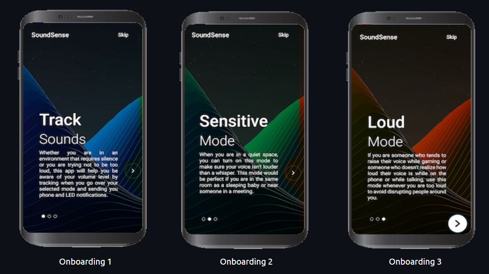
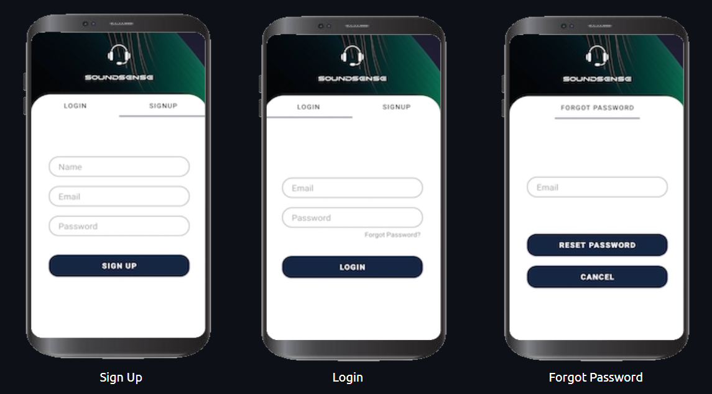
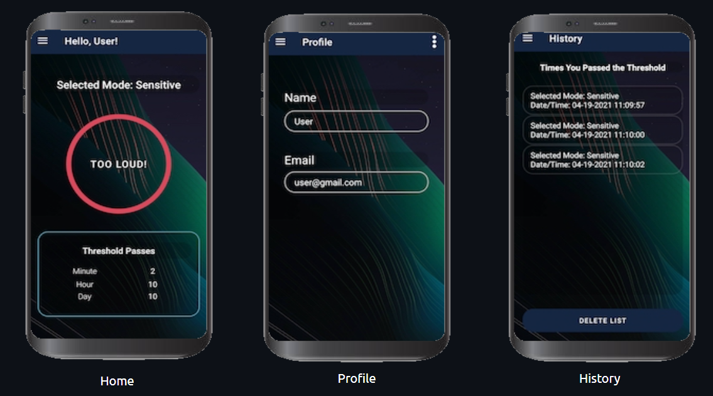
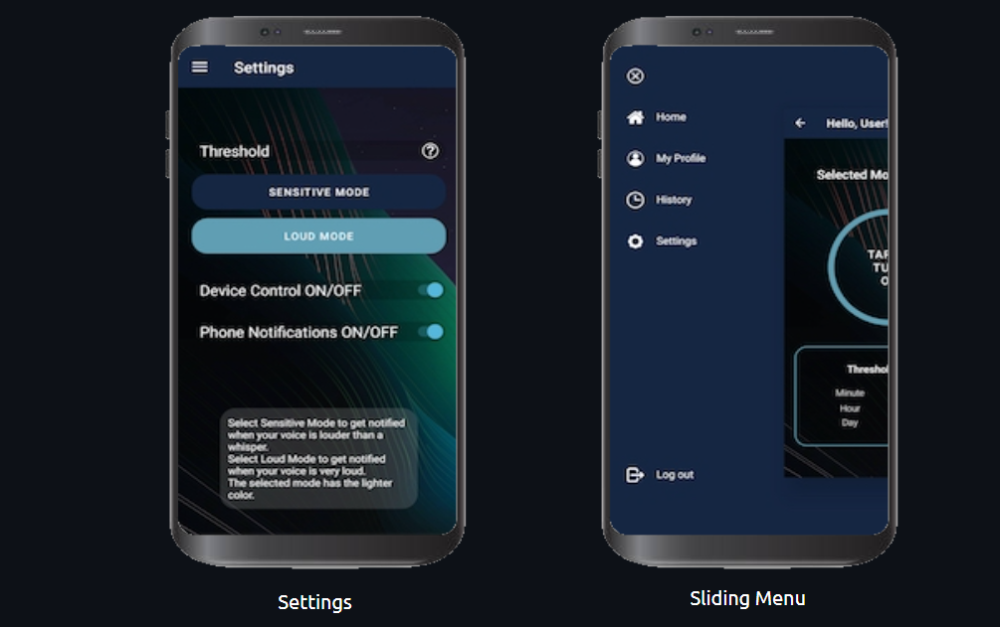

# SoundSense-Android
SoundSense is a device that prevents users from being too loud indoors. 
Whether you're playing video games with headphones on or in the library, 
the Soundsense App will send you a notification that you're being too loud.

